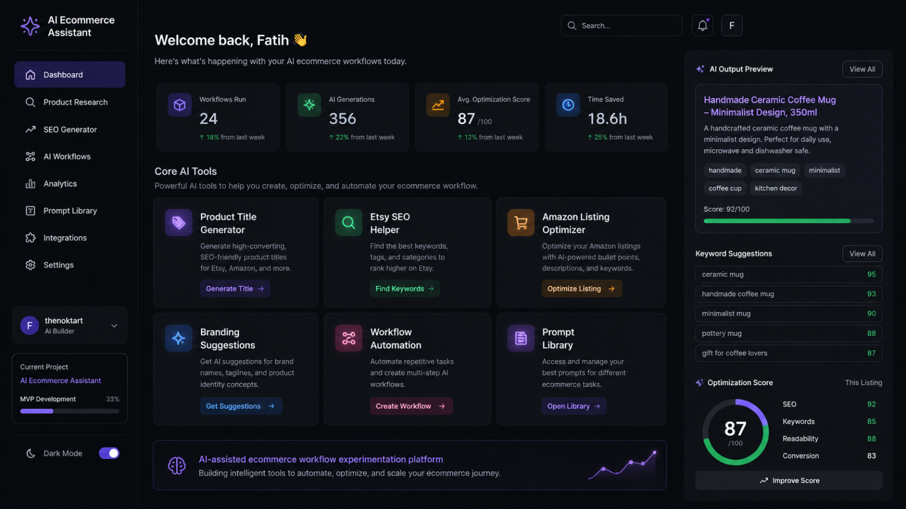

# AI Ecommerce Assistant

An experimental AI-assisted ecommerce workflow system focused on product research, listing optimization, branding workflows, SEO generation, and automation.

This repository explores how AI systems can improve ecommerce operations, digital product workflows, and online brand building.

---

## Core Features

- AI-generated product titles
- Etsy SEO assistance
- Amazon listing optimization
- Product research workflows
- Branding prompt systems
- AI-assisted content generation
- Automation pipeline experiments

---

## Why This Project Exists

I became interested in AI systems while building ecommerce brands, digital workflows, listing systems, and automation processes.

This project documents my experiments with combining:
- AI tools,
- ecommerce systems,
- automation workflows,
- and rapid product iteration.

---

## Planned Features

- [ ] AI title generator
- [ ] Product description generator
- [ ] Listing optimization workflow
- [ ] Keyword suggestion system
- [ ] Branding assistant prompts
- [ ] AI workflow automation experiments
- [ ] Dashboard interface concepts

---

## Tools & Technologies

- Python
- OpenAI API
- Prompt engineering
- Automation workflows
- Ecommerce systems
- GitHub documentation

---

## Current Status

Early-stage public experimentation project exploring practical AI-assisted ecommerce systems.
